  

<h1 align="center">👋 Hola, soy <strong>fr3g0nass</strong></h1>

  <strong>💻 Full Stack Developer in Progress</strong>

  

---

## 🛠️ Tech Stack

### 💻 Languages

  

### ⚙️ Frameworks & Runtime

  

### 🗄️ Databases & DevOps

  

### 🎮 Other Technologies

  

---

## 👀 Profile Views

  

---

  

